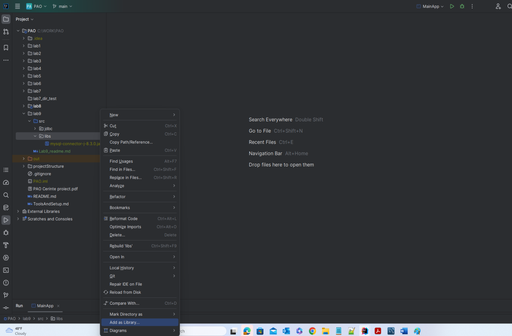
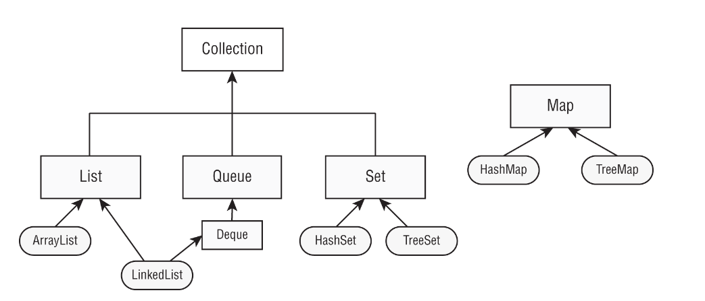

# JDBC (Java Database Connectivity). Colectii

# JDBC - project setup
* Download & Install Mysql: https://dev.mysql.com/downloads/installer/
* Inregistrare JDBC driver pentru a putea realiza conexiunea la baza de date, folosind una din urmatoarele optiuni:
  * Utilizinad Maven, se adauga dependenta necesara (https://mvnrepository.com/artifact/com.mysql/mysql-connector-j) in fisierul pom.xml
  ```java
          <dependency>
            <groupId>com.mysql</groupId>
            <artifactId>mysql-connector-j</artifactId>
            <version>8.3.0</version>
          </dependency>
  ```
  
  * Se downloadeaza jar-ul necesar si se adauga ca si librarie pentru proiect in Intellij:

* Creare baza de date (din MySQL Workbench): `create database lab9;`
* Creare tabela si procedura stocata in DataSetup.java


# Colectii


Exista patru interfente principale in Java Collections framework:
* **List**: colectie de elemente ordonate, accesibile printr-un int index 
* **Set**: colectie de elemente unice (fara duplicate)
* **Queue**: interfata ce defineste o coada, cu operatiile aferente.Subinterfata Deque este definita ca o coada cu doua capete, poate fi folosita atat ca si coada, cat si ca si stiva.
* **Map**: interfata ce implementeaza o structura de tip pereche cheie-valoare


