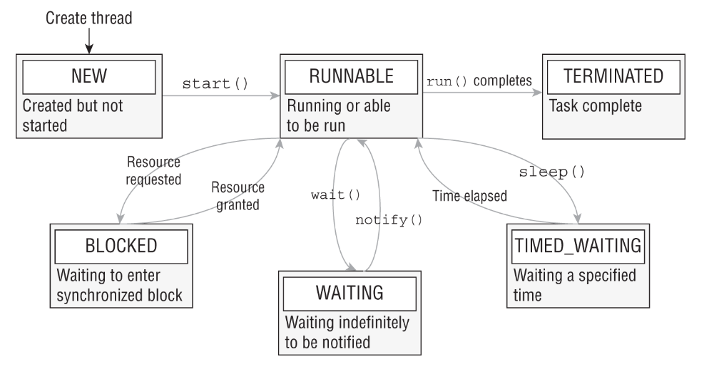

# Fire de executare (Threads)

* Un thread este o succesiune secventiala de instructiuni care se executa in cadrul unui proces.
* Un program multithreaded contine doua sau mai thread-uri care ruleaza simultan.
* In Java, primul thread care starteaza este cel al metodei main (main thread)
* Aplicatie single threaded = aplicatia starteaza din metoda main si nu mai creaza alte thread-uri

## Definirea si startarea unui Thread
### Prin extinderea clasei Thread
Definirea:
```java
public class MyThread extends Thread {
    @Override
    public void run() {
        // do something
    }
}
```
Crearea si startarea:
```java
    MyThread t = new MyThread();
    t.start();
```
### Prin implementarea interfetei Runnable
Definirea:
```java
public class MyRunnableThread implements Runnable {
    @Override
    public void run() {
        // do something
    }
}
```
Crearea si startarea:
```java
    MyRunnableThread runnableThread = new MyRunnableThread();
    new Thread(runnableThread).start();
```
## Thread states


## Thread methods
* **sleep(long ms)** -  suspendă executarea thread-ului curent pentru ms milisecunde;
* **join()** - suspenda executarea thread-ului parinte pana la terminarea thread-ului curent
* **interrupt()** - intrerupe executarea thread-ului curent
* **interrupted()** - testeaza daca thread-ul curent este intrerupt sau nu

## Object methods
* **wait()** - face ca thread-ul curent sa astepte pana va fi notificat sau intrerupt
* **notify()** - reactiveaza (il pune in starea runnable) un thread
* **notifyAll()** - reactiveaza toate thread-urile
* Aceste metode ale clasei Object, sunt thread-related, fac ca thread-urile sa comunice intre ele. Sunt dificil de utilizat corect, ar trebui evitate si folosit Concurrency API (java.util.concurrent) pe cat de mult posibil.

## Sincronizarea
* Thread-urile mai pot comunica intre ele partajand o resursa comuna (field-uri, baze de date). Controlul accesului la aceasta resursa se face folosind **_synchronized_** keyword.
* Totusi, utilizarea improprie a sincronizarii poate determina o problema/disputa a thread-urilor.
De exemplu atunci cand doua sau mai multe thead-uri incearca sa acceseze aceasi resursa in acelasi timp, cauzand Java runtime sa execute unul sau mai multe threaduri mai lent, sau chiar sa suspende executia lor.
Astfel de cazuri sunt deadlock, starvation, livelock.
* Deadlock - situatie in care doua sau mai multe threaduri sunt permanent blocate, asteptand unul dupa altul
* Starvation - situatie in care un thread nu este capabil sa obtina accesul la o resursa comuna si sa continue executia.
Acest lucru se intampla cand resursa comuna nu este disponibila pentru o perioada mare de timp din cauza altor threaduri "greedy"
* Livelock - situatie in care thread-urile isi raspund cu o actiune unul altuia la nesfarsit.

### Sincronizarea metodelor

* Sintaxa (se adauga _synchronized_ in declaratia metodei):
```java
  public synchronized void increment() {
    c++;
  }
```
* O metoda synchronized poate fi accesata doar de un singur thread la un moment dat. In acel moment alte threaad-uri care vor sa acceseze metoda, isi vor suspenda executia pana cand primul thread isi termina executia sa.
* Constructorii nu pot fi declarati synchronized - deoarece un singur thread care creeaza obiectul trebuie sa aiba acces la el in timpul construirii lui. 

### Sincronizarea blocurilor
* Sintaxa:
```java
  public void increment() {
    synchronized(this) {
        c++;
    }
  }
```
