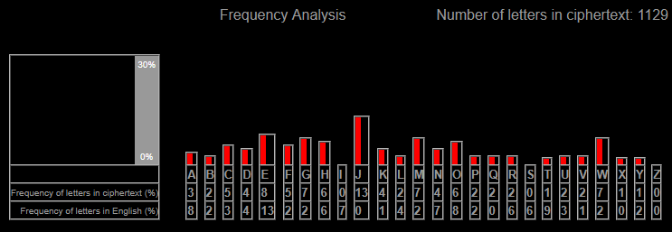
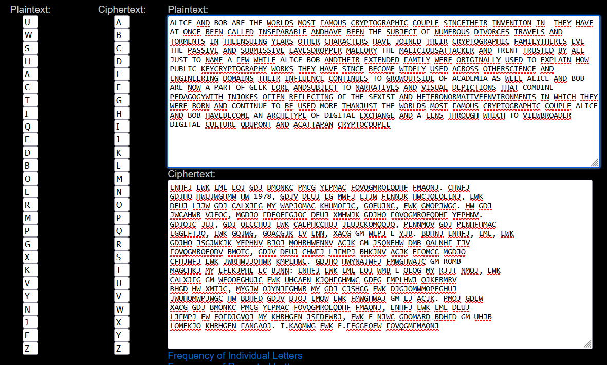

# Lab 3

## 1

### .1

#### Message in Base64

```o9/khC3Pf3/9CyNCbdzHPy5oorccEawZSFt3mgCicRnihDSM8Obhlp3vviAVuBbiOtCSz6husBWqhfF0Q/8EZ+6iI9KygD3hAfFgnzyv9w==```

#### Message in Binary

```
10100011 11011111 11100100 10000100 00101101 11001111 01111111 01111111 11111101 00001011 00100011 01000010 01101101 11011100 11000111 00111111 00101110 01101000 10100010 10110111 00011100 00010001 10101100 00011001 01001000 01011011 01110111 10011010 00000000 10100010 01110001 00011001 11100010 10000100 00110100 10001100 11110000 11100110 11100001 10010110 10011101 11101111 10111110 00100000 00010101 10111000 00010110 11100010 00111010 11010000 10010010 11001111 10101000 01101110 10110000 00010101 10101010 10000101 11110001 01110100 01000011 11111111 00000100 01100111 11101110 10100010 00100011 11010010 10110010 10000000 00111101 11100001 00000001 11110001 01100000 10011111 00111100 10101111 11110111
```

#### Key in Hex

```ecb181a479a6121add5b42264db9b44b4b48d7d93c62c56a3c3e1aba64c7517a90ed44f8919484b6ed8acc4670db62c249b9f5bada4ed474c9e4d111308b614788cd4fbdc1e949c1629e12fa5fdbd9```

#### Key in Binary

```
11101100 10110001 10000001 10100100 01111001 10100110 00010010 00011010 11011101 01011011 01000010 00100110 01001101 10111001 10110100 01001011 01001011 01001000 11010111 11011001 00111100 01100010 11000101 01101010 00111100 00111110 00011010 10111010 01100100 11000111 01010001 01111010 10010000 11101101 01000100 11111000 10010001 10010100 10000100 10110110 11101101 10001010 11001100 01000110 01110000 11011011 01100010 11000010 01001001 10111001 11110101 10111010 11011010 01001110 11010100 01110100 11001001 11100100 11010001 00010001 00110000 10001011 01100001 01000111 10001000 11001101 01001111 10111101 11000001 11101001 01001001 11000001 01100010 10011110 00010010 11111010 01011111 11011011 11011001
```

#### XOR

After XOR Operation and ASCII Conversion

```
One Time Pad este un sistem de criptare perfect sigur daca este folosit corect.
```

### .2

#### Key Hexadecimal 

```ecad8de748ef0b1a857f032101bdb51f5e07c3c37931c37b3c3219ef748215708cf046a18588c1e2f897ca0076ca7f924eb1e6efcb1b905afed5d110228d24049b8242bec6e11d82699409fa1281d9```

### .3

If attackers have access to multiple messages encrypted with the same key, they can essentially decrypt all the messages.

## 2

### .1 Arnold Cipher

#### Encryption

Encryption requires a book (physical or scanned) with numbered pages.

In order to encrypt a word, it must be located among the pages of the book (which implies that the book is large enough and / or contains a maximum of words).

Each word is encoded by a triplet of numbers: a page number, a line number on that page and a word number on that line.

#### Decryption

Decryption requires knowing / possessing the book used during encryption. It is essential that it is the same book (or the same edition, with the same layout).

For each triplet (X, Y, Z), the receiver must open the book on page X, count line Y on the page, and note the word number Z on the line.

#### Security

The total number of books in the world is finite (approximately 129,864,880), which theoretically allows for a brute-force attack to decrypt messages encoded using books as ciphers.

#### Cryptanalysis

An attacker could attempt a brute-force attack by systematically guessing books and checking whether the resulting message is coherent rather than random gibberish.

### .2 Caesar Box Cipher
 
#### Encryption

1. Determine the grid size:

   - The message length N must fit into a square grid of size M×M (where M=ceil(sqrt(N))

   - If the message is too short, it is padded with extra characters (e.g., X, _, or spaces).

2. Write the message into the grid row-wise:

    - Example plaintext: `SECRETMESSAGE`

    - If N=14, then M=4 (since 4×4=16, and padding is added).

```
S E C R  
E T M E  
S S A G  
E X X X
```

3. Read the message column-wise to obtain ciphertext:

Reading top to bottom, left to right: `SESEETSMCAXXRGEXX`

#### Decryption

1. The recipient must know the grid size and arrange the ciphertext column-wise into a square grid.

2. The text is then read row-wise to reconstruct the original plaintext.

3. Any padding characters are removed to retrieve the exact message.

#### Security

If the attacker knows the approximate message length, they can test possible grid sizes and attempt reconstruction.

#### Cryptanalysis

Brute-force attacks: Since the grid size is limited by message length, all possible transpositions can be tested.

## 3

Frequencies

```[('J', 122), ('E', 79), ('G', 71), ('M', 66), ('W', 66), ('H', 62), ('O', 56), ('C', 48), ('F', 45), ('D', 41), ('K', 37), ('N', 36), ('A', 28), ('Q', 24), ('L', 22), ('P', 20), ('V', 19), ('R', 17), ('U', 17), ('B', 16), ('Y', 13), ('X', 6), ('T', 5), ('S', 4), ('I', 1)]```



After substitution

```
ALICE AND BOB ARE THE WORLDS MOST FAMOUS CRYPTOGRAPHIC COUPLE. SINCE
THEIR INVENTION IN 1978, THEY HAVE AT ONCE BEEN CALLED INSEPARABLE, AND
HAVE BEEN THE SUBJECT OF NUMEROUS DIVORCES, TRAVELS, AND TORMENTS. IN THE
ENSUING YEARS, OTHER CHARACTERS HAVE JOINED THEIR CRYPTOGRAPHIC FAMILY.
THERES EVE, THE PASSIVE AND SUBMISSIVE EAVESDROPPER, MALLORY THE MALICIOUS
ATTACKER, AND TRENT, TRUSTED BY ALL, JUST TO NAME A FEW. WHILE ALICE, BOB, AND
THEIR EXTENDED FAMILY WERE ORIGINALLY USED TO EXPLAIN HOW PUBLIC KEY
CRYPTOGRAPHY WORKS, THEY HAVE SINCE BECOME WIDELY USED ACROSS OTHER
SCIENCE AND ENGINEERING DOMAINS. THEIR INFLUENCE CONTINUES TO GROW
OUTSIDE OF ACADEMIA AS WELL: ALICE AND BOB ARE NOW A PART OF GEEK LORE, AND
SUBJECT TO NARRATIVES AND VISUAL DEPICTIONS THAT COMBINE PEDAGOGY
WITH IN-JOKES, OFTEN REFLECTING OF THE SEXIST AND HETERONORMATIVE
ENVIRONMENTS IN WHICH THEY WERE BORN AND CONTINUE TO BE USED. MORE THAN
JUST THE WORLDS MOST FAMOUS CRYPTOGRAPHIC COUPLE, ALICE AND BOB HAVE
BECOME AN ARCHETYPE OF DIGITAL EXCHANGE, AND A LENS THROUGH WHICH TO VIEW
BROADER DIGITAL CULTURE. Q.DUPONT AND A.CATTAPAN CRYPTOCOUPLE
```


