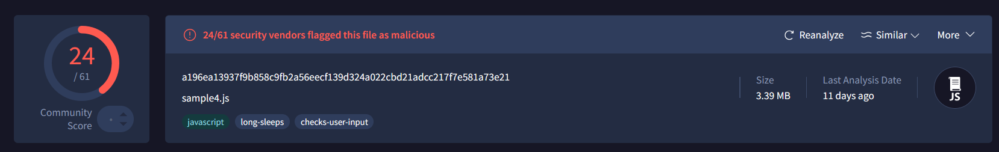
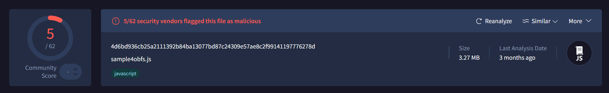

# Lab 5

## 1

a.

```
Facultatea de Matematica si Informatica
Universitatea din Bucuresti
https://www.youtube.com/watch?v=HIcSWuKMwOw
```

b.

I ran the code in an online node.js interpreter

c.

```
var ascuns = "Mesaj ascuns: 18367622009998665"
```

d.

Obsfucator

## 2

a.

```
WScript.Echo("You have been hacked!");WScript.Echo("I hope you did not run this on your own PC...")
```

b.

```javascript
WScript.Echo("You have been hacked!");
WScript.Echo("I hope you did not run this on your own PC...");
var f = "Facultatea";
var mi = "de Matematica si Informatica";
var unibuc = "Universitatea din Bucuresti";
var curs = "Curs Info anul 3";
var minciuna = "Acesta este un malware. Dispozitivul este compromis";
var adevar = "Stringul anterior este o minciuna";
try {
    var obj = new ActiveXObject("Scripting.FileSystemObject");
    var out = obj.OpenTextFile("./fmi.txt", 2, true, 0);
    out.WriteLine("Bun venit la acest laborator :)");
    out.Close();
    var fle = obj.GetFile("./fmi.txt");
    fle.attributes = 2
} catch (err) {
    WScript.Echo("Do not worry. Ghosts do not exist!")
}
```

All it does is create a `.txt` file. So not a malware.

c.

Eval

## 3 

a. 

Same as the one above, but a different obfuscation method used.

b.

They are hexadecimal values. Likely representing variables and their values.

c. 

This one uses hexadecimal characters to prevent static analysis.

## 4

a.

Prints `Hello`.

b.

We can convert the payload from base64 into ASCII. 

c.

No. It did not affect the hardware in any way and did not mess with our data.

d.

24/61 vendors flagged this file as malicious.
Might be malware.

e.


